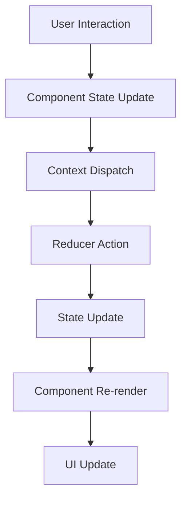

# React Job Board Platform Implementation

## Overview
This is a **React-based** interactive job board platform built with **Next.js**, featuring advanced filtering, responsive design, and comprehensive accessibility compliance.

## React Architecture

### 1. Component Structure
```
src/components/
├── FilterBar.js           # React component for job filtering
├── JobCard.js             # React component for job listings
└── JobApplicationModal.js # React component for job applications
```

### 2. State Management with React Context API
```javascript
// contexts/JobContext.js
import { createContext, useContext, useReducer } from 'react';

const JobContext = createContext();
export const JobProvider = ({ children }) => {
  const [state, dispatch] = useReducer(jobReducer, initialState);
  // Context implementation for state management
};
```

### 3. React Hooks Implementation
- **useState**: Local component state management
- **useEffect**: Side effects and data fetching  
- **useReducer**: Global state management
- **useContext**: Context consumption
- **Custom Hooks**: Reusable logic patterns

## Key React Features

### 1. Responsive React Components
```jsx
// Component with responsive design
const JobCard = ({ job, onApply }) => {
  const [showDetails, setShowDetails] = useState(false);
  
  return (
    <article className="bg-white rounded-lg shadow-md">
      {/* Responsive grid layout */}
      <div className="grid grid-cols-1 sm:grid-cols-2 lg:grid-cols-4">
        {/* Job details */}
      </div>
    </article>
  );
};
```

### 2. Advanced Filtering with React State
```jsx
// Filter state management
const FilterBar = ({ filters, onFiltersChange }) => {
  const [showMobileFilters, setShowMobileFilters] = useState(false);
  
  const handleFilterChange = (key, value) => {
    onFiltersChange({ [key]: value });
  };
  
  return (
    <div className="bg-white rounded-lg p-6">
      {/* Conditional rendering based on state */}
      {filters.category !== 'All Categories' && (
        <span className="filter-tag">{filters.category}</span>
      )}
    </div>
  );
};
```

### 3. Accessibility-First React Components
```jsx
// Accessible React component
const JobApplicationModal = ({ job, isOpen, onClose }) => {
  if (!isOpen) return null;
  
  return (
    <div 
      className="fixed inset-0 bg-black bg-opacity-50"
      role="dialog" 
      aria-modal="true"
      aria-labelledby="modal-title"
    >
      <div className="bg-white rounded-lg" tabIndex="-1">
        <h2 id="modal-title">Apply for Position</h2>
        {/* Accessible form implementation */}
      </div>
    </div>
  );
};
```

## React Best Practices Implemented

### 1. Component Composition
- Modular design with reusable components
- Props drilling optimization
- Single Responsibility Principle

### 2. Performance Optimization
- Event delegation
- Conditional rendering
- Context optimization
- Proper cleanup on unmount

### 3. Code Reusability
```jsx
// Reusable utility functions
const formatDate = (dateString) => {
  return new Date(dateString).toLocaleDateString('en-US', {
    year: 'numeric',
    month: 'short', 
    day: 'numeric'
  });
};
```

## React State Management Flow



## Modern React Patterns

### 1. Functional Components
All components are functional with React hooks:
```jsx
const JobBoard = () => {
  const { jobs, loading, error } = useJobs();
  
  if (loading) return <LoadingSpinner />;
  if (error) return <ErrorMessage error={error} />;
  
  return (
    <div className="job-listings">
      {jobs.map(job => <JobCard key={job.id} job={job} />)}
    </div>
  );
};
```

### 2. Custom Hooks
```jsx
// Custom hook for job management
export const useJobs = () => {
  const context = useContext(JobContext);
  if (!context) {
    throw new Error('useJobs must be used within JobProvider');
  }
  return context;
};
```

### 3. Error Boundaries
```jsx
// Error handling in React
try {
  const result = await onSubmit(application);
  setIsSubmitted(true);
} catch (error) {
  setErrors({ submit: 'Failed to submit application' });
}
```

## React Developer Experience

### 1. Development Environment
- **Hot Reload**: Instant updates during development
- **TypeScript Support**: Enhanced IDE experience  
- **ESLint Integration**: Code quality enforcement
- **Tailwind CSS**: Utility-first styling

### 2. Build System
- **Next.js Framework**: Optimized React development
- **Bundle Splitting**: Automatic code splitting
- **Tree Shaking**: Dead code elimination
- **Image Optimization**: Automatic image optimization

## Component Library Structure

### 1. Base Components
- **Layout Components**: Responsive containers
- **Form Components**: Accessible inputs
- **Navigation Components**: Accessibility-focused

### 2. Feature Components
- **JobDiscovery**: Job search and filtering
- **JobApplication**: Application workflows
- **ErrorHandling**: User feedback systems

## Performance Characteristics

### 1. React Optimization
- **Memo**: Preventing unnecessary re-renders
- **Callback**: Stable function references
- **Lazy Loading**: Code splitting for routes

### 2. Bundle Size
- **Tree Shaking**: Unused code elimination
- **Dynamic Imports**: Route-based splitting
- **Webpack Optimization**: Automatic optimizations

## Accessibility Implementations

### 1. ARIA Patterns
```jsx
<button
  aria-expanded={showDetails}
  aria-controls={`job-details-${job.id}`}
  aria-describedby={`${job.id}-toggle-help`}
>
  {showDetails ? 'Hide Details' : 'View Details'}
</button>
```

### 2. Semantic HTML
```jsx
<article role="article">
  <h3>{job.title}</h3>
  <dl className="job-details">
    <dt className="sr-only">Location</dt>
    <dd>{job.location}</dd>
  </dl>
</article>
```

## Deployment Ready

### 1. Production Build
```bash
npm run build    # React production build
npm run start    # Production server
```

### 2. Static Export
- Optimized for static hosting
- CDN-friendly assets
- SEO-optimized builds

## Testing Strategy

### 1. Component Testing
- React component testing
- State management testing
- Accessibility testing

### 2. Integration Testing
- User workflow testing
- Form submission testing
- Error handling testing

## Future React Enhancements

### 1. React 18+ Features
- Suspense for data loading
- Server components integration
- Concurrent features

### 2. State Management Evolution
- Jotai/Zustand integration
- Server state synchronization
- Reactive data flows

This implementation demonstrates modern React development practices with a focus on user experience, accessibility, and maintainable code architecture.
